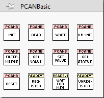
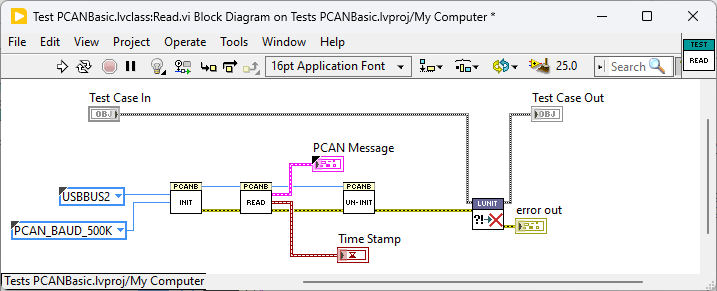
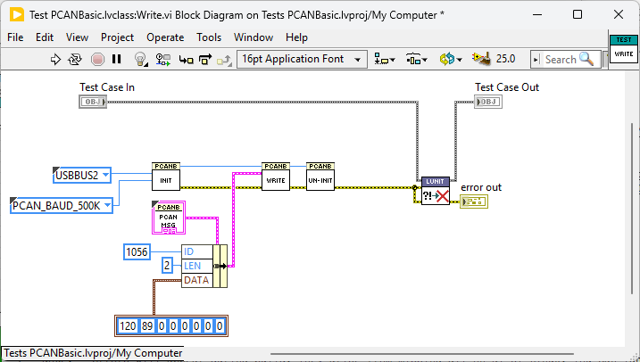
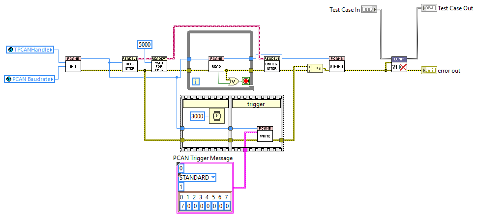

# PCAN Basic LabVIEW

A lightweight wrapper for [PCAN Basic API](https://www.peak-system.com/PCAN-Basic.239.0.html). 
This wrapper has been tested against version PCAN Basic API **V4.10.1.968** with Peak Driver **8.20.0** (Linux), **4.6.4** (Windows x86/x64).

This project includes code for event driven read on linux rt from the [LinuxRT-IPC](https://github.com/NISystemsEngineering/LinuxRT-IPC) project, licensed under Apache License 2.0.

---

## VIPM

The `vipm` folder contains a VIPM package with the VIs necessary to interface the driver from LabVIEW.  
It creates a **PCAN Basic** palette under Instrument I/O.

---

## Prerequisites

- **LabVIEW 2019 64 bit**
- **(Optional) LUnit Test Framework (LabVIEW 2020)** – [GitHub Repository](https://github.com/Astemes/astemes-lunit)
### **NI-RT Linux**
  - Download [PCAN Basic for Linux](https://www.peak-system.com/quick/BasicLinux)
  - Copy peak-linux-driver-8.20.0.tar.gz to /home/lvuser/ on real-time target using a [FTP client](https://knowledge.ni.com/KnowledgeArticleDetails?id=kA03q000000YMLnCAO&l=en-GB) or [Webdav](https://knowledge.ni.com/KnowledgeArticleDetails?id=kA03q000000YGytCAG&l=en-US)
  - Enter following commands in [terminal](https://knowledge.ni.com/KnowledgeArticleDetails?id=kA03q000000YHpxCAG&l=en-GB) to build and install pcan linux driver on NI-RT Linux:
```
  cd /home/lvuser
  tar -xzf peak-linux-driver-8.20.0.tar.gz
  cd peak-linux-driver-8.20.0
  make clean
  make
  sudo make install
  sudo mkdir -p /lib/modules/$(uname -r)/misc
  sudo cp $(find /lib/modules/ -name "pcan.ko" | head -n 1) /lib/modules/$(uname -r)/misc/
  sudo find /lib/modules/ -name "pcan.ko" ! -path "/lib/modules/$(uname -r)/*" -exec rm {} \;
  sudo depmod -a
  sudo modprobe pcan
```
  > **Note:** Errors will appear during build. They arise from missing g++ on NI-RT Linux. You can ignore these.
### **Windows**
  - Install [PCAN Driver 4.6.4 for Windows](https://www.peak-system.com/quick/DrvSetup_4x) 
  - Download [PCAN Basic API 4 for Windows](https://www.peak-system.com/fileadmin/media/files/PCAN-Basic_4x.zip)
  - From PCAN-Basic_4x.zip copy `x86/PCANBasic.dll` to `/Windows/SysWOW64`
  - From PCAN-Basic_4x.zip copy `x64/PCANBasic.dll` to `/Windows/System32`

## Palette

  
## Sample Usage
### Read

### Write

### Read Event Driven



