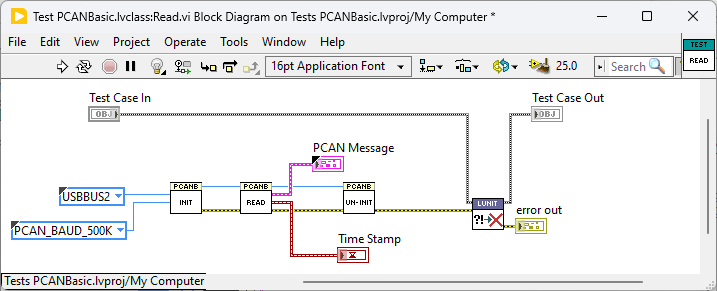
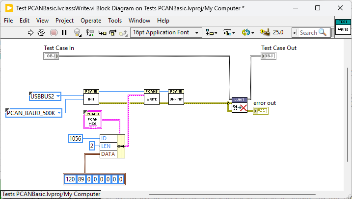

# PCAN Basic LabVIEW

A lightweight wrapper for [PCAN Basic API](https://www.peak-system.com/PCAN-Basic.239.0.html). 
This wrapper has been tested against version Peak Linux Driver **8.20.0** and PCAN Basic **V4.8.2.897**.

---

## VIPM

The `vipm` folder contains a VIPM package with the VIs necessary to interface the driver from LabVIEW.  
It creates a **PCAN Basic** palette under *Addons*.

---

## Prerequisites

- **LabVIEW 2019 64 bit**
- **(Optional) LUnit Test Framework (LabVIEW 2020)** – [GitHub Repository](https://github.com/Astemes/astemes-lunit)
### **NI-RT Linux**
  - Download [PCAN Basic for Linux](https://www.peak-system.com/quick/BasicLinux)
  - Copy peak-linux-driver-8.20.0.tar.gz to /home/lvuser/ on real-time target using a [FTP client](https://knowledge.ni.com/KnowledgeArticleDetails?id=kA03q000000YMLnCAO&l=en-GB) or [Webdav](https://knowledge.ni.com/KnowledgeArticleDetails?id=kA03q000000YGytCAG&l=en-US)
  - Enter following commands in [terminal](https://knowledge.ni.com/KnowledgeArticleDetails?id=kA03q000000YHpxCAG&l=en-GB) to build and install pcan linux driver on NI-RT Linux:
```
  cd /home/lvuser
  tar -xzf peak-linux-driver-8.20.0.tar.gz
  cd peak-linux-driver-8.20.0
  make clean
  make
  sudo make install
  cd driver
  sudo insmod pcan.ko
  sudo modprobe pcan
```
  > **Note:** Errors will appear during build. They arise from missing g++ on NI-RT Linux. You can ignore these.
### **Windows**
  - Install [PCAN driver for Windows](https://www.peak-system.com/produktcd/Drivers/PeakOemDrv.exe)
  - Download [PCAN Basic API for Windows](https://www.peak-system.com/fileadmin/media/files/PCAN-Basic.zip)
  - From pcan-basic.zip copy `Win32/PCANBasic.dll` to `/Windows/SysWOW64`
  - From pcan-basic.zip copy `X64/PCANBasic.dll` to `/Windows/System32`
  
## Sample Usage
### Read

### Write


